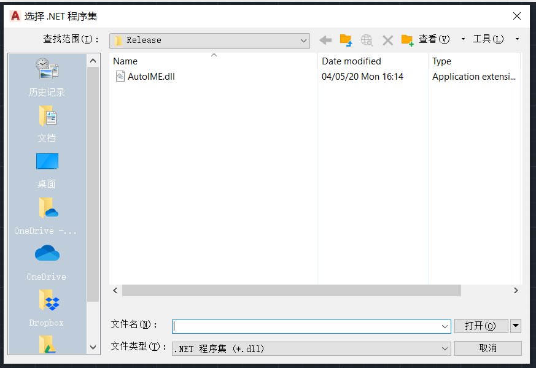
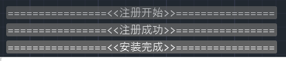
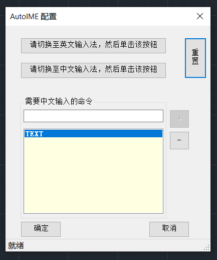
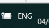
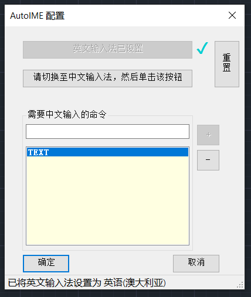
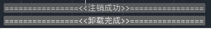

# AutoIME 使用说明

## 安装

1. 将 AutoIME.zip 解压至任意文件夹；

2. 启动 AutoCAD 2021，输入 `NETLOAD` 命令加载 DLL，找到 **AutoIME.dll**，单击**打开**；

   

3. 输入以下任一命令进行**安装**：

   1. `iAutoIME` -- `i` 为 ”安装“ 的英文缩写 (`install`)
   2. `pvuf` -- 此为 “安装” 的五笔编码
   3. `azAutoIME` -- `az`为 ”安装“ 拼音首字母

4. 显示以下信息即为安装成功：

   

## 设置

### 输入法设置

1. 输入 `SetIME` 将弹出输入法设置窗口：

   

2. 从上往下依次设置：

   1. 首先切换至**英文**键盘，然后单击  <kbd>请切换至英文输入法，然后单击该按钮</kbd> 

      

      

      按钮变灰并提示设置成功即可。

   2. **中文**输入法类似操作。
   
3. 如想重新设置，可单击 <kbd>重置</kbd> 按钮

### 添加命令

1. 在白色文本框中输入需要中文输入法的命令，如`TEXT`；
2. 单击 <kbd>+</kbd> 添加到列表中；

### 删除命令

1. 在列表中选择想要删除的命令；
2. 单击 <kbd>-</kbd> 即可删除；

### 保存与取消

1. 单击 <kbd>确定</kbd> 即可保存；
2. 单击<kbd>取消</kbd> 或关闭窗口<kbd>X</kbd> 将取消本次设置，所做更改不会保存。

## 卸载

1. 输入以下任一命令进行**卸载**：

   1. `uAutoIME` -- `u` 为 ”卸载“ 的英文缩写 (`uninstall`)
   2. `rhfa` -- 此为 “卸载” 的五笔编码
   3. `xzAutoIME` -- `xz`为 ”卸载“ 拼音首字母

2. 显示以下信息即为安装成功：

   